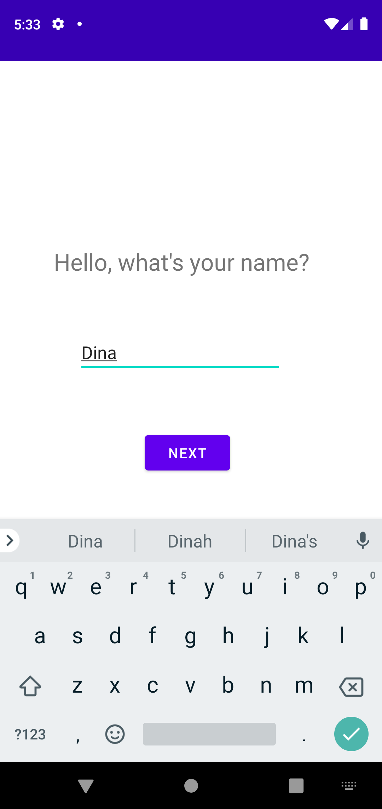
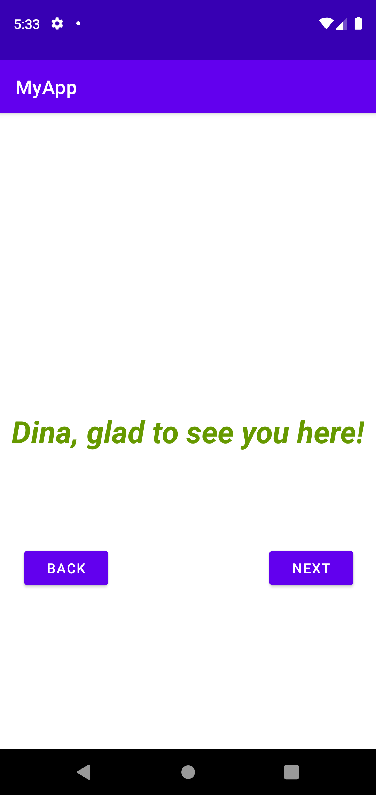
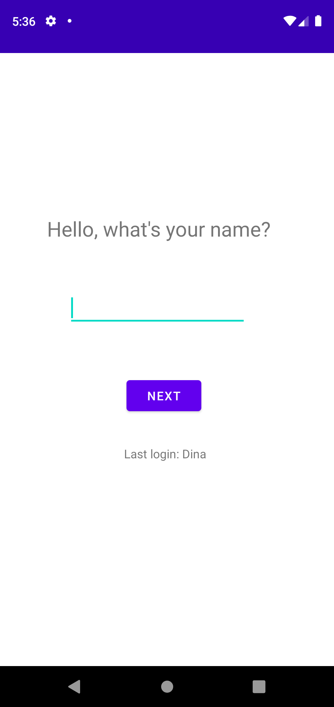
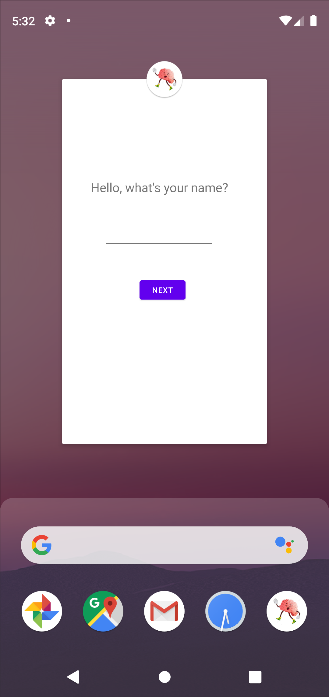

# PAM - Programming of Mobile Applications

## Laboratory Work Nr. 2: what has been done
1. Picked a theme for the app - an authentic social network which will connect people by sharing creativity, interests and will have no metrics [like likes/followers]
2. Implemented basic UI and layout for the app - 3 functional screens [login, agreement, feed activity]
3. Populated feed activity with data [posts/ 30 elements] by using RecyclerView

## Laboratory Work Nr. 1: what has been done

1. Mobile application initialization on selected platform: Native Android mobile application installed on Android Studio & written using Kotlin language
2. Created 2 screens which transfer data from first screen to second one, the screens: MainActivity & NewActivity

###### 

###### 

3. Performed changes to data that has been passed in screen 1 and sent it back modified: Name of last person who logged in

###### 

4. Added buttons for going to next page and to back page and handled their actions, i.e.:

        backButton = findViewById(R.id.button2)
        backButton.setOnClickListener {
            val lastLogin = "Last login: $message"
            val resultIntent = Intent()
            resultIntent.putExtra("LastLogin", lastLogin)
            setResult(Activity.RESULT_OK, resultIntent)
            finish()
        }
        
5. Changes the icon of the app:

###### 

--------